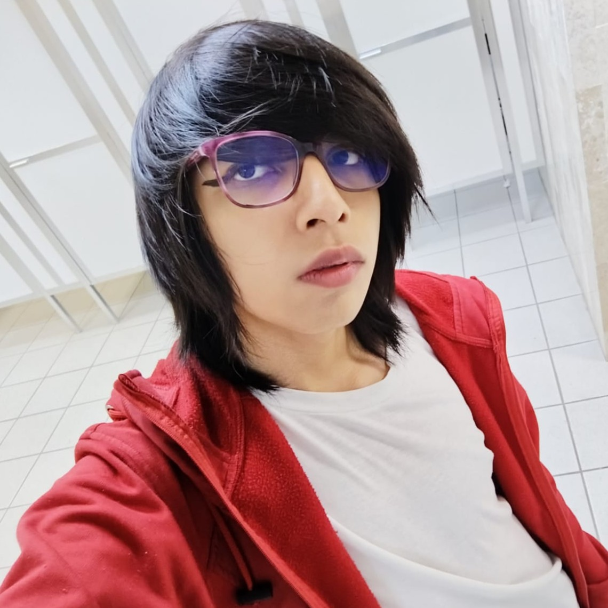
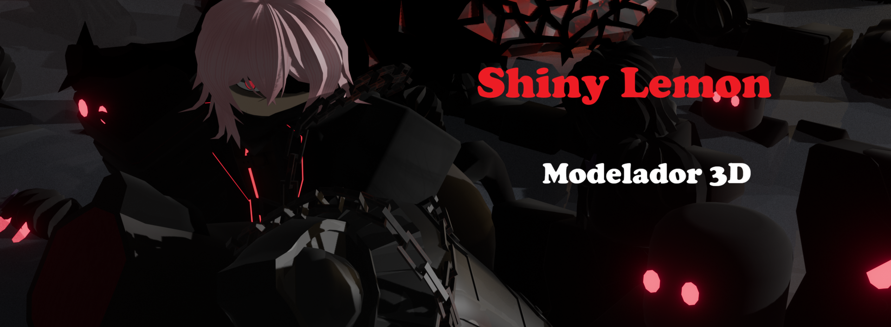
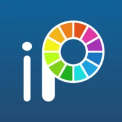
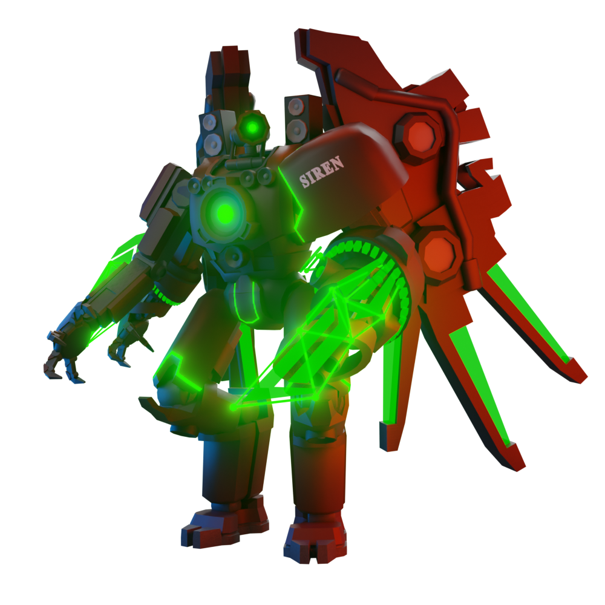
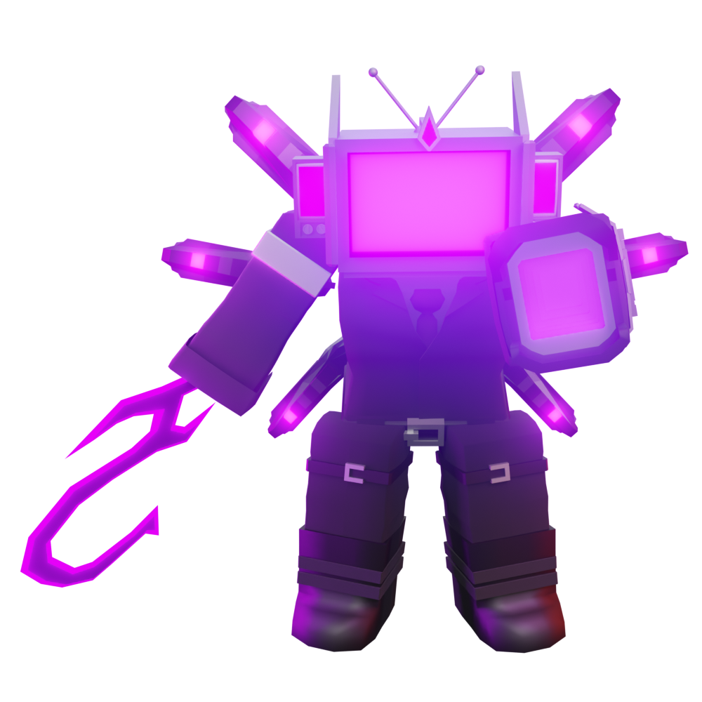

# Jarhoshani Quechol Torres

Perfil profesional en Diseño y Modelado 3D

<table>
<tr>
<td width="150">

</td>
<td>

<h1>Jarhoshani Quechol Torres</h1>
<h3>Diseñador Gráfico | Modelador 3D | Animador</h3>

📍 San Benito Yauhquemehcan, Tlaxcala, México  
📧 zealot581super@gmail.com  
📱 241-103-2001  
🌐 <a href="https://linktr.ee/ShinyLemon0612">Redes sociales</a>

</td>
</tr>
</table>

<a href="#sobre-mi">🎨 Sobre mí</a> |
<a href="#perfil-profesional">🧑‍💼 Perfil</a> |
<a href="#tecnologias">🛠️ Tecnologías</a> |
<a href="#habilidades">⭐ Habilidades</a> |
<a href="#idiomas">🌎 Idiomas</a> |
<a href="#experiencia">💼 Experiencia</a> |
<a href="#educacion">🎓 Educación</a> |
<a href="#proyectos">🚀 Proyectos</a>

## 🎨 Sobre mí

Soy un apasionado del modelado 3D, artista y animador de 19 años. Me caracterizo por una ética de trabajo incansable: no doy por terminado un proyecto hasta que el resultado alcanza mis estándares de calidad y perfección. Me motiva un sueño que he perseguido desde la infancia, lo que impulsa mi constante aprendizaje y dedicación en cada pieza que creo.

---

## 🧑‍💼 Perfil Profesional

Especialista en creación de activos digitales con enfoque en **Modelado 3D, Animación y Dibujo**. Capaz de transformar conceptos en modelos tridimensionales detallados y funcionales. Cuento con bases en desarrollo web y gestión de bases de datos, lo que me permite entender el flujo de trabajo en entornos digitales complejos y videojuegos.

---

# 🛠️ Tecnologías y Herramientas

## 🎨 Diseño, Modelado y Arte Digital

<table border="0" style="border:none;">
<tr align="center">

<td>
 
Blender
</td>

<td>
 
Ibis Paint
</td>

<td>
 
Roblox Studio
</td>

</tr>
</table>

## 👨‍💻 Desarrollo y Bases de Datos

## 📊 Herramientas de Oficina

---

# ⭐ Habilidades personales

- **Búsqueda de la perfección:** Atención minuciosa al detalle en cada modelo y animación.
- **Trabajo en equipo:** Gran capacidad para colaborar y sumar al talento colectivo.
- **Adaptabilidad:** Ajuste rápido a diferentes flujos de trabajo y equipos.
- **Trabajo bajo presión:** Mantenimiento de la calidad bajo tiempos de entrega exigentes.

---

# 🌎 Idiomas

- **Español** — Nativo  
- **Inglés** — Avanzado

---

# 💼 Experiencia laboral

## 🎮 Toilet Legacy Defense  
**Modelador 3D** | Agosto 2024 - Febrero 2025  

- Creación y optimización de múltiples personajes para el entorno del juego.
- Modelado detallado siguiendo especificaciones técnicas de animación.
- Colaboración directa con el equipo de desarrollo para la integración de activos.

---

# 🎓 Educación

**TSU en Tecnologías de la Información (En curso)** Universidad Tecnológica de Tlaxcala | 2024 - 2027

---

# 🚀 Proyectos Destacados

### 👾 Videojuegos Tower Defense
Participación activa como modelador en los siguientes títulos:
- **Toilet Legacy Defense**
- **Toilet Domination Defense**
- **Camera Tower Defense**

---

